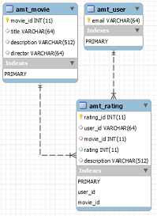

# AMT - Project Two

Le projet se compose de deux APIs Rest, l'une de gestion d'utilisateurs, l'autre permettant de consulter des films et de leur attribuer une note et une description. Chacune des APIs dispose de sa propre base de donnée et une topologie docker permet d'automatiser le lancement des backends, de leurs bases de données ainsi que d'un container *traefik*, agissant comme reverse-proxy. Des procédures de tests automatisés permettent en outre de valider le bon fonctionnement des APIs.

## Authentication API

La première API Rest consiste en la gestion et l'authentification d'utilisateurs, de manière générale. Une route permet de s'authentifier afin d'obtenir un token JWT, qui servira à être reconnu lors de toutes les requêtes futures sur les deux APIs (celui-ci devra être introduit dans l'en-tête Authorization de chaque requête). D'autres routes servent à visualiser les données des utilisateurs.

Une fois authentifié, un utilisateur a la possibilité s'il est administrateur de créer un nouveau compte, ou de visualiser les données personnelles de n'importe quel autre utilisateur. Lors de la création d'un utilisateur, celui-ci est entré dans la base de donnée, avec son mot de passe haché. La liste complète des routes est disponible [ici](doc/apis)

## Movies API

La seconde API permet à un utilisateur authentifié de consulter une liste (paginée) de films contenus dans la base de donnée (chargés au lancement à partir d'un fichier .csv) en entrant éventuellement un mot clé comme query-string, de voir tous les votes relatifs à un film donné, de voir la liste complète de ses propres votes, d'en ajouter, d'en supprimer ou d'en mettre à jour de nouveaux. La table qui identifie les utilisateurs ne contient que leur id (email) et ils y sont ajoutés la première fois qu'ils utilisent l'API.

Lorsqu'un utilisateur ajoute un vote (note et description), une relation est établie entre lui et le film, comme l'illustre le schéma suivant :

La liste exhaustive des différentes routes est résumée [ici](doc/apis).

## Lancement

Pour lancer la topologie docker, il suffit d'exécuter le script *launcher.sh* à la racine du projet. Celui-ci va effectuer les étapes suivantes :

* clean-and-build les deux projets spring boot afin de générer les .jar
* copier les .jar à l'endroit où se trouvent les images docker spring boot
* lancer le `docker-compose up --build` pour générer les six containers (2 backends spring, 2 containers mysql, phpmyadmin et traefik)

Pour plus de détails concernant les bases de données mysql et leur images docker, cliquer [ici](doc/databases).

## Utilisation

La procédure de lancement prends un certain temps. Une fois terminée, les APIs sont accessibles par le biais du reverse proxy traefik à l'URL **http://<IP_machine_docker>/<context_root>**. Remplacer **<context_root>** par **/movies-api/** ou **/users-api** pour que traefik redirige les requêtes vers les bons backends.

Une fois à la racine de l'une ou l'autre API, la page d'accueil swagger s'ouvre, avec le résumé des routes disponibles, ainsi que les paramètres à entrer dans les requêtes pour chacune d'entre elles.

Pour tester le fonctionnement des APIs, il est possible par exemple d'entrer les credentials d'un utilisateur authentifié (*simon.jobin@bluewin.ch* et mot de passe *password* sur **/users-api/authentication**, récupérer le JWT obtenu et l'utiliser sur l'ensemble des autres routes. Il est bien sûr possible de tester les APIs avec d'autres outils, comme *curl* ou *Postman*.

Il est également possible d'observer l'état des bases de données via **http://<IP_machine_docker>:6060**, qui nous redirige sur le container phpmyadmin, accessible avec les credentials *admin - admin* et nous permet de choisir le serveur mysql voulu.

Pour terminer la topologie docker, simplement entrer la commande `docker-compose down` et éventuellement nettoyer les volumes utilisés lors de la création containers mysql avec `docker volume prune`.

## Tests effectués

Des tests automatisés côté client avec *cucumber* permettent de valider le fonctionnement des deux backends. Pour lancer les tests, il suffit de se placer à la racine du projet et de lancer le script *test.sh*. Pour plus de détails sur les tests couverts, cliquer [ici](doc/tests).

## Améliorations possibles à apporter

* renforcer la sécurité (JWT plus valable après un certain temps,...)
* meilleur traitement des exceptions
* test de charge avec JMeter
