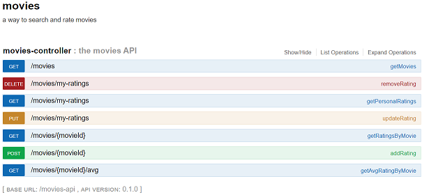

## Liste des routes pour l'API users

* **POST /authentication** entrée des credentials et obtention d'un JWT
* **GET /users** liste des utilisateurs
* **POST /user** ajout d'un nouvel utilisateur (admin uniquement)
* **GET /user/{email}** détail d'un utilisateur en particulier

Aperçu swagger-ui:

## Liste des routes pour l'API movies

* **GET /movies** liste paginée des films présents
* **DELETE /movies/my-ratings** suppression d'un vote
* **GET /movies/my-ratings** retourne les votes personnels
* **PUT /movies/my-ratings** mettre à jour un vote existant
* **GET /movies/{movieId}** retourne tous les votes pour un film donné
* **POST /movies/{movieId}** ajout d'un nouveau vote pour un film donné
* **GET /movies/{movieId}/avg** note moyenne pour un film (pas encore implémenté)

Aperçu swagger-ui:

